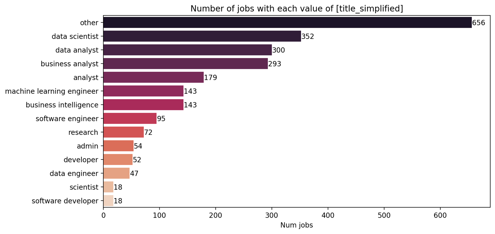
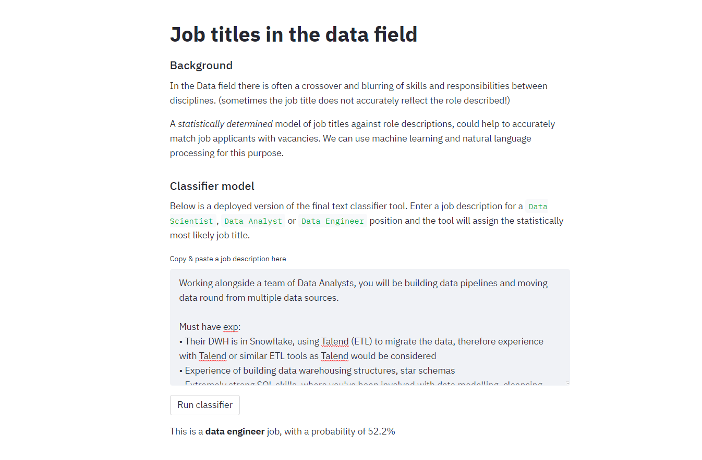

# jobs-analysis

While looking at job websites I noticed how the skills and responsibilities of different data-disciplines cross over and blur together. 

To clear up the confusion I created an NLP job title classifier to automatically classify job titles based on the description text. This could boost recruitment efficiency, better reaching the most suitable candidates and drive consistency of job titling across the industry.

# Summary
- Wrote a web-scraper to extract over 2000 job adverts from [uk.indeed.com](indeed.com)
- Manually extracted "skill tags" for each role *(Python, Cloud, Machine Learning etc)*.
- [Deployed the model as a web-app](https://share.streamlit.io/adin786/jobs-analysis/main/app/app_deploy.py) using StreamLit, allowing anyone to classify a job as 'Data Scientist', 'Data Analyst', or 'Data Engineer'.

**Libraries:** `Requests` `BeautifulSoup4` `Pandas` `NTLK` `Seaborn` `Scikit-learn` `Streamlit`

## Web-scraping
I web-scraped over 2000 job adverts from uk.indeed.com for roles across the data analytics field.

## Data exploration
Below shows the class distribution of my dataset after labelling the each job by it's base job title. Indeed's job search seems to include lots of relevant, but uncommon job titles so the other category is over-represented. This may impact the classifier's performance but I was able to achieve good results with some resampling.

Ignoring this, the dataset included a large number of `Data Scientist` and `Data Analyst` positions. However `Data Engineer` jobs seemed to be poorly represented on Indeed's database.

### Manually encoded "skills"
I manually extracted common skills from the description text. In the future I may build a Named Entity Recognition model to automatically extract these kinds of tags but for now these are manually encoded using regular expressions.

Below shows a heatmap of how these "skill tags" varied depending on the job title, normalised against class distribution.

As a summary of what this illustrates:
- Predictably, excel is required quite universally across disciplines, esp. in **Admin** roles.
- **Data Engineer** are the only ones commonly mentioning ETL
- **Data Engineers** are needed to be experts in cloud platorms, so are **SW engineers**
- **Data scientists** and **Data Engineers** are required to have SQL skills
- Predictably **ML Engineers** require ML knowledge, but the plain **Scientist** role also has high demand for it, maybe these roles were just given a generic title?
- Devops is most relevant to **Software Engineer** and **Data Engineer** jobs
- Statistics is most relevant to **Data Scientist** and plain **Scientist** roles
- NLP was actually mentioned fairly rarely amongst **Data Scientist** roles

## Classification model
The classifier was based on a Multinomial Naive-Bayes model from Scikit-learn.  

To keep the modelling simple, it was trained on a subset of the dataset for only 3 classes: **Data Scientist**, **Data Analyst**, 
and **Data Engineer** roles.  At a later date I may look to re-train a modela across all classes in the dataset, but as shown in 
the heatmap earlier, the class boundaries are fuzzy and 

The NLP model training pipeline includes the following steps before the classifier:
  - Custom text preprocessor which takes each job description and generates a "bag-of-words":
    - Tokenise by sentence
    - Tokenise by word
    - Remove stopwords (common "filler" words)
    - Lemmatize (strips each word back to it's root meaning)
    - Add Bigrams (double-word combinations)
  - Vectorise the bag-of-words using the TF-IDF method
  - Apply SMOTE resampling to compensate for the class imbalance

The NaiveBayes model does not have many hyperparameters to play with, but the finished classifer was tuned using 
the Grid Search method, with 3-fold cross validation to tune for the best parameters of the TF-IDF vectoriser.  

The most accurate and generalisable classifier model was one which ignores out any tokens which occurred extremely frequently in many job adverts, and words which occur very infrequently.

## Deployment
I used the StreamLit python framework to rapidly build this model into a deployable web application. I considered uploading this to AWS ElasticBeanStalk however StreamLit offers a turn-key solution to very easily deploy to their pre-configured cloud instances.  

The web-app is (should be) live at [the following link](https://share.streamlit.io/adin786/jobs-analysis/main/app/app_deploy.py)

Anyone can paste in any job advert text, and the model will classify it as 

## Future work
- In the future I would expand the model to include other scraped job title classes, not just DS/DE/DA.
- I would build a Named Entity Recognition model to automatically extract the "skill tags" rather casting such a wide net over the overall text.
- I would experiment more with n-grams, and try some deep-learning based models with transfer learning due to the small-ish dataset.
